# SIPREH — Architecture, Structure, and System Generalities
### Paper: *Development of a Drought Monitoring and Forecasting System for Bogotá and Its Water Supply Basins, Colombia*

---

## 1. System Architecture Diagram

```mermaid
flowchart TD
    %% ─── DATA SOURCES ───────────────────────────────────────────────────────
    subgraph DS["☁️  DATA SOURCES"]
        ERA5["ERA5 Reanalysis\n0.25° · ECMWF"]
        ERA5L["ERA5-Land\n0.1° · ECMWF"]
        IMERG["IMERG\n0.1° · NASA GPM"]
        CHIRPS["CHIRPS\n0.05° · UCSB/USGS"]
        IDEAM["IDEAM Stations\n29 hydrological gauges"]
    end

    %% ─── CLOUD STORAGE ──────────────────────────────────────────────────────
    subgraph CS["🪣  CLOUD STORAGE  (Cloudflare R2 / S3-compatible)"]
        R2_HIST["Historical Parquet Files\n(SPI · SPEI · RAI · EDDI · PDSI)"]
        R2_PRED["Prediction Parquet File\nprediction_main.parquet\n(12-month ensemble forecast)"]
        R2_HYDRO["Hydrological Parquet Files\n(SDI · SRI · MFI · DDI · HDI)"]
    end

    %% ─── BACKEND ────────────────────────────────────────────────────────────
    subgraph BE["⚙️  BACKEND  (FastAPI · Python · Uvicorn)"]
        direction TB

        subgraph INGEST["Data Ingestion & Management"]
            UPLOAD["Admin Upload API\nPOST /admin/files/upload"]
            META["Metadata Extractor\nPyArrow schema · row counts · date ranges"]
            SYNC["Cloud Sync Service\nbidirectional SQLite ↔ R2"]
        end

        subgraph PROC["Query & Processing Engine"]
            DUCKDB["DuckDB Query Engine\n10–100× faster than Pandas\non Parquet files"]
            WS["Watershed Aggregation\n7 basins · area-weighted intersection"]
            CACHE["Two-Level Cache\nRedis (primary) · in-memory (fallback)\n50× speedup · TTL 900 s"]
            TIER["Tiered Storage Manager\nephemeraldisk cache · background preload"]
        end

        subgraph SERVICES["Domain Services"]
            HIST_SVC["Historical Data Service\nSpatial 2D · Timeseries 1D\nWatershed aggregation"]
            PRED_SVC["Prediction Data Service\n12 horizons · Q1/Q3/IQR bands\nVersioning by issued_at"]
            HYDRO_SVC["Hydrological Data Service\nStation timeseries · severity percentiles"]
            AI_SVC["AI Summary Service\nGroq API · Llama 3.1-8b\nSpanish drought summaries"]
        end

        subgraph API["REST API  (/api/v1)"]
            AUTH_EP["/auth — JWT login · refresh"]
            ADMIN_EP["/admin — files · datasets · users · sync"]
            HIST_EP["/historical — catalog · timeseries · spatial"]
            PRED_EP["/prediction — cells · timeseries · spatial · summary · history"]
            HYDRO_EP["/hydro — stations · indices · timeseries · spatial"]
            DASH_EP["/dashboard — clustered summary endpoint"]
        end

        DB[("SQLite / PostgreSQL\nFile metadata · Users · Datasets")]
        AUTH["JWT Authentication\naccess + refresh tokens"]
    end

    %% ─── FRONTEND ───────────────────────────────────────────────────────────
    subgraph FE["🖥️  FRONTEND  (Next.js · React)"]
        direction TB

        subgraph UI_COMP["Interface Components"]
            MAP["Interactive Map\nLeaflet.js · 3-level drill-down grid\n7 watershed polygons · station markers"]
            TS_CHART["Timeseries Chart\nuPlot · LTTB downsampling\nzoom / pan · export PNG/CSV"]
            PRED_CHART["Prediction Chart\nCanvas 2D · 12-month horizon\nIQR uncertainty bands"]
            ADMIN_UI["Admin Dashboard\nfile management · cloud sync · user roles"]
        end

        subgraph SECTIONS["Sidebar Sections"]
            HIST_SEC["Historical Section\nindex · scale · date selector"]
            PRED_SEC["Prediction Section\ncurrent forecast map"]
            HIST_PRED_SEC["Prediction History\nissued_at version selector"]
        end

        EXPORT["Export Utilities\nCSV timeseries · PNG maps"]
    end

    %% ─── USER ───────────────────────────────────────────────────────────────
    USER["👤  End User\n(Researcher · Water Manager · Decision Maker)"]

    %% ─── CONNECTIONS ────────────────────────────────────────────────────────
    ERA5 & ERA5L & IMERG & CHIRPS --> R2_HIST
    IDEAM --> R2_HYDRO
    R2_HIST --> HIST_SVC
    R2_PRED --> PRED_SVC
    R2_HYDRO --> HYDRO_SVC

    UPLOAD --> META --> DB
    META --> SYNC --> CS

    HIST_SVC & PRED_SVC & HYDRO_SVC --> DUCKDB
    DUCKDB --> CACHE
    DUCKDB --> WS
    CACHE --> TIER
    PRED_SVC --> AI_SVC

    HIST_SVC --> HIST_EP
    PRED_SVC --> PRED_EP
    HYDRO_SVC --> HYDRO_EP
    AI_SVC --> PRED_EP
    DB --> ADMIN_EP
    AUTH --> AUTH_EP

    AUTH_EP & ADMIN_EP & HIST_EP & PRED_EP & HYDRO_EP & DASH_EP --> FE

    MAP --> HIST_SEC & PRED_SEC
    TS_CHART --> HIST_SEC
    PRED_CHART --> PRED_SEC & HIST_PRED_SEC
    ADMIN_UI --> ADMIN_EP

    FE --> USER
    USER --> EXPORT
```

> **Render tip:** Paste this diagram into [mermaid.live](https://mermaid.live) or any Mermaid-compatible viewer (VS Code, GitHub, Notion) for the full interactive graph.

---

## 2. Paper Section — Architecture, Structure, and Generalities of SIPREH

### 2.1 System Overview

SIPREH (*Sistema Integral de Predicción y Reconstrucción del Estado Hídrico*) is a web-based platform designed for the continuous monitoring, historical analysis, and probabilistic forecasting of drought conditions over the city of Bogotá and the seven major water supply basins that feed it: La Regadera, Chisacá, Sisga, Chuza, Neusa, Tominé, and San Rafael. The system integrates multisource satellite-derived and reanalysis climate data with outputs from numerical hydrometeorological models, presenting results through a highly interactive geospatial interface oriented toward researchers, water resource managers, and public decision-makers.

The platform follows a three-tier architecture composed of (i) a cloud data storage layer, (ii) a RESTful backend processing engine, and (iii) a reactive web frontend, as illustrated in Figure X. Each tier is independently deployable, loosely coupled through a versioned HTTP API, and designed to scale horizontally as data volumes grow.

---

### 2.2 Data Sources and Ingestion Layer

SIPREH ingests climate and hydrological data from four gridded sources at different spatial resolutions, allowing users to evaluate drought conditions across multiple observation scales (Table 1).

**Table 1. Gridded data sources integrated in SIPREH.**

| Source | Provider | Resolution | Primary Use |
|--------|----------|-----------|-------------|
| ERA5 | ECMWF (Copernicus) | 0.25° (~28 km) | Atmospheric reanalysis baseline |
| ERA5-Land | ECMWF (Copernicus) | 0.1° (~11 km) | Higher-resolution land surface fields |
| IMERG Final Run | NASA GPM | 0.1° (~11 km) | Satellite precipitation (1998–present) |
| CHIRPS v2.0 | UCSB / USGS | 0.05° (~5.5 km) | High-resolution gridded precipitation |

In addition, observational records from 29 hydrological monitoring stations operated by IDEAM (the Colombian Institute of Hydrology, Meteorology and Environmental Studies) are used for validation and for the computation of streamflow-based drought indices. All gridded data are preprocessed externally and stored as Apache Parquet columnar files in a Cloudflare R2 object storage bucket (an S3-compatible cloud store). The long-format schema follows the structure `{date, lat, lon, variable, value, scale, source}`, which allows multiple indices, scales, and data sources to coexist within a single file while enabling efficient columnar filtering.

File metadata (schema, row counts, spatial and temporal extents, variable catalogue) is extracted at upload time using PyArrow and persisted in a relational database (SQLite for local deployments, PostgreSQL for production). A bidirectional synchronization service ensures consistency between the local metadata store and the files physically present in cloud storage, enabling an administrator to register externally uploaded files without repeating the upload through the system interface.

---

### 2.3 Backend Processing Engine

The backend is implemented as a REST API using **FastAPI** (Python 3.11+), served via **Uvicorn** (ASGI). It is organised into five functional layers: authentication, administration, data query services, caching, and AI-assisted summarisation.

#### 2.3.1 Query Engine

All data retrieval from Parquet files is executed through **DuckDB**, an in-process analytical database that reads Parquet files directly from disk or from object storage without materialising them into memory. Benchmarks carried out during system development showed that DuckDB queries over 50-million-row Parquet files complete 10–100 times faster than equivalent Pandas-based pipelines, making interactive latencies achievable even for the largest historical datasets.

Three query patterns are supported:

- **1D (timeseries):** extracts all dates for a single spatial cell identified by latitude/longitude pair, returning a time series of index values with associated severity category.
- **2D (spatial):** extracts all spatial cells for a single date, returning a grid of (lat, lon, value, severity) tuples suitable for map rendering.
- **Watershed aggregation:** computes area-weighted averages over the cells that intersect each of the seven named watersheds, using precomputed intersection fractions stored as a static lookup table.

#### 2.3.2 Caching Strategy

To ensure response times compatible with interactive exploration, SIPREH implements a two-level cache:

1. **Disk-level tiered storage:** Parquet files are downloaded from R2 on first access and stored in an ephemeral local directory (configurable up to 10 GB). Subsequent requests read from disk, eliminating cloud-egress latency.
2. **Result-level Redis cache:** DuckDB query results are serialised and cached in Redis with a configurable TTL (default 900 s). Cache hits return pre-computed JSON payloads in the order of single-digit milliseconds, yielding a measured ~50× speedup relative to uncached queries. An in-memory dictionary serves as a fallback when a Redis instance is not available.

#### 2.3.3 Drought Indices

SIPREH computes and serves five meteorological and five hydrological drought indices (Table 2 and Table 3), which are calculated externally and ingested as precomputed Parquet files. The system is index-agnostic at the API level: it reads any `variable`/`scale` combination present in the loaded files.

**Table 2. Meteorological drought indices.**

| Index | Full Name | Scales | Description |
|-------|-----------|--------|-------------|
| SPI | Standardised Precipitation Index | 1, 3, 6, 12 months | Probability of observed precipitation relative to the historical distribution; normalised to standard normal units. |
| SPEI | Standardised Precipitation-Evapotranspiration Index | 1, 3, 6, 12 months | Extends SPI by incorporating potential evapotranspiration, making it sensitive to temperature-driven demand. |
| RAI | Rainfall Anomaly Index | 1, 3, 6, 12 months | Signed anomaly of precipitation relative to long-term mean; computationally simple and directly interpretable. |
| EDDI | Evaporative Demand Drought Index | 1, 3, 6, 12 months | Quantifies anomalies in atmospheric evaporative demand; an early-warning indicator preceding precipitation-based drought. |
| PDSI | Palmer Drought Severity Index | Unscaled | Water-balance model that accounts for supply, demand, and soil moisture; widely used in global drought assessments. |

All meteorological indices are classified into seven severity categories following the standardised scale: *Extreme Wet* (> +2.0), *Severe Wet* (+1.5 to +2.0), *Moderate Wet* (+1.0 to +1.5), *Near Normal* (−1.0 to +1.0), *Moderate Drought* (−1.5 to −1.0), *Severe Drought* (−2.0 to −1.5), and *Extreme Drought* (< −2.0).

**Table 3. Hydrological drought indices.**

| Index | Full Name | Basis | Severity Scale |
|-------|-----------|-------|---------------|
| SDI | Streamflow Drought Index | Standardised cumulative streamflow | Fixed bins (SPI-equivalent) |
| SRI | Standardised Runoff Index | Standardised runoff | Fixed bins |
| MFI | Monthly Flow Index | Percentile rank of monthly flow | Quintiles (P20/P40/P60/P80) |
| DDI | Drought Duration Index | Duration × deficit below threshold | Percentile-based |
| HDI | Hydrological Deficit Index | Cumulative deficit below threshold | Percentile-based |

#### 2.3.4 Forecasting Module

The forecasting component ingests a pre-generated ensemble prediction file (`prediction_main.parquet`) that contains probabilistic monthly outlooks for up to 12 horizons ahead. Each record stores the predicted index value together with the first and third quartiles (Q1, Q3) and the interquartile range (IQR) derived from the ensemble spread, enabling explicit uncertainty quantification. The prediction file carries an `issued_at` timestamp that serves as a version identifier; when a new forecast is uploaded, the previous version is archived rather than overwritten, so users can navigate and compare past forecast issues through a dedicated interface.

An AI-assisted summarisation service consumes the statistical outputs of the current prediction (spatial distribution, anomaly magnitudes, dominant severity categories) and generates a concise, plain-language interpretation in Spanish via the **Groq API** (model: Llama 3.1-8b-instant, temperature 0.3). This feature lowers the interpretive barrier for non-specialist stakeholders by translating numerical fields into actionable drought narratives.

#### 2.3.5 API Structure

The API is versioned under `/api/v1` and grouped into six router modules:

| Router prefix | Responsibility |
|--------------|---------------|
| `/auth` | JWT-based authentication (login, token refresh, user profile) |
| `/admin` | File management, dataset configuration, user administration, cloud synchronisation |
| `/historical` | Data catalogue, 1D timeseries, 2D spatial snapshots, file listing, cross-validation |
| `/prediction` | Current and historical forecast cells, timeseries, AI summary, version history |
| `/hydro` | Station catalogue, hydrological timeseries, spatial data |
| `/dashboard` | Pre-aggregated summary endpoint optimised for full-map rendering with spatial clustering |

Interactive API documentation is auto-generated by FastAPI at `/docs` (Swagger UI) and `/redoc` (ReDoc).

---

### 2.4 Frontend and Visualisation Layer

The web interface is built with **Next.js 14** (React 18), consuming the REST API and rendering results in a responsive single-page layout. The interface is organised around a persistent interactive map and a contextual sidebar.

#### 2.4.1 Interactive Map

The geospatial viewer is implemented with **Leaflet.js** and exposes a three-level drill-down grid hierarchy that adapts its resolution to the zoom level. When a user clicks a grid cell, the system dispatches a 1D timeseries request for that cell and renders the result in the adjacent chart panel without a full page reload. The map simultaneously overlays watershed polygon boundaries, hydrological station markers, and the continuous drought-index colour field, allowing users to contextualise point-level and catchment-level information within the same view.

#### 2.4.2 Timeseries and Prediction Charts

Historical timeseries are rendered with **uPlot**, a high-performance JavaScript chart library. For datasets exceeding the display resolution, the frontend applies **Largest-Triangle-Three-Buckets (LTTB)** downsampling, which preserves the perceptual shape of the series while reducing the number of rendered points by up to two orders of magnitude. This makes 30-year monthly records fully interactive at client side.

Forecast charts are rendered on an HTML5 Canvas element with custom drawing routines that shade the IQR uncertainty band in a semi-transparent fill overlapping the deterministic forecast line. A dropdown selector allows users to compare the current forecast against any previously issued prediction archived in the system.

#### 2.4.3 Export Capabilities

Users can export any visualised timeseries as a CSV file (date, value, severity category columns) or capture any map or chart panel as a PNG/JPEG image. Export functions are implemented entirely on the client side to avoid additional server round-trips.

---

### 2.5 Technology Stack Summary

**Table 4. SIPREH technology stack.**

| Layer | Technology | Version | Role |
|-------|-----------|---------|------|
| Backend API | FastAPI + Uvicorn | ≥ 0.110 | Asynchronous REST server |
| Query engine | DuckDB | ≥ 0.10 | Analytical queries on Parquet |
| Data I/O | PyArrow | ≥ 15 | Parquet read / metadata extraction |
| Cache | Redis + in-memory | — | Two-level result cache |
| Object storage | Cloudflare R2 (boto3) | S3-compatible | Parquet file hosting |
| Relational DB | SQLite / PostgreSQL | — | Metadata, users, datasets |
| AI summarisation | Groq API (Llama 3.1-8b) | — | Plain-language forecast summaries |
| Frontend framework | Next.js (React) | 14 / 18 | SPA web interface |
| Map library | Leaflet.js | ≥ 1.9 | Interactive geospatial viewer |
| Chart library | uPlot | ≥ 1.6 | High-performance timeseries plots |
| Authentication | JWT (PyJWT) | — | Stateless access control |

---

### 2.6 Target Region

The system covers an approximate domain of 4.0°N–5.5°N, 73.5°W–74.5°W, encompassing the metropolitan area of Bogotá D.C. and the seven regulated reservoirs that supply the city's drinking water: La Regadera, Chisacá, Sisga, Chuza, Neusa, Tominé, and San Rafael. The watersheds are digitised as polygon geometries and used by the backend watershed aggregation service to compute spatially representative index values for each catchment. At CHIRPS resolution (0.05°), the study domain is represented by approximately 297 grid cells, which constitutes the highest-resolution analysis layer available in the system.

---

*End of architecture section draft.*
